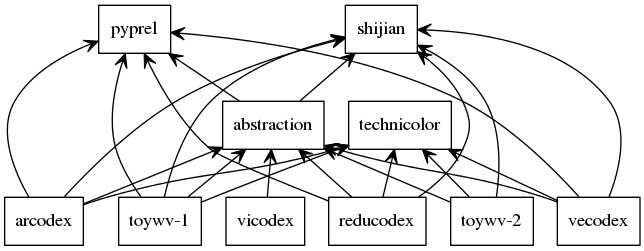

[](https://www.youtube.com/watch?v=v9zJ9noLeok)

# NOTE

Please note that abstraction is a *project*, not a finished product.

# setup

The following Bash commands, that have been tested on Ubuntu 15.10, should install prerequisites and check out abstraction.

```Bash
# Install ROOT.
sudo apt-get -y install sqlite
sudo apt-get -y install python-nltk
sudo python -m nltk.downloader all
sudo easy_install -U gensim
sudo pip install --upgrade https://storage.googleapis.com/tensorflow/linux/cpu/tensorflow-0.8.0-cp27-none-linux_x86_64.whl
sudo pip install git+git://github.com/google/skflow.git
sudo pip install abstraction
git clone https://github.com/wdbm/abstraction.git
```

The function `abstraction.setup()` should be run.

# upcoming

Under consideration is a requirement for arcodex to ensure the existence of a response to an utterance before saving to database.

# logging

Updating logging procedures is under consideration because of possible logging conflicts. It could be beneficial currently to run using Bash anonymous pipes, in a way like the following:

```Bash
python script.py 2> >(grep -E -v "INFO|DEBUG")
```

# data

## feature scaling

Standardization of datasets is a common requirement for many machine learning estimators implemented in the scikit; they might behave badly if the individual features do not more or less look like standard normally-distributed data: Gaussian with zero mean and unit variance -- often called a standard scores. Many machine learning algorithms assume that all features are centered around zero and have variance of the same order. A feature with a variance that is orders of magnitude larger that others might dominate the objective function and make the estimator unable to learn from other features. The scikit function `scale` provides a quick way to perform this operation on a single array-like dataset.

## SUSY Data Set

- <https://archive.ics.uci.edu/ml/datasets/SUSY>
- <http://arxiv.org/abs/1402.4735>

The SUSY Data Set is a classification problem to distinguish between a signal process which produces supersymmetric particles and a background process which does not. In the data, the first column is the class label (1 for signal, 0 for background), followed by 18 features (8 low-level features and 10 high-level features):

- lepton 1 pT
- lepton 1 eta
- lepton 1 phi
- lepton 2 pT
- lepton 2 eta
- lepton 2 phi
- missing energy magnitude
- missing energy phi
- MET_rel
- axial MET
- M_R
- M_TR_2
- R
- MT2
- S_R
- M_Delta_R
- dPhi_r_b
- cos(theta_r1)

This data has been produced by MadGraph5 Monte Carlo simulations of 8 TeV proton collisions, with showering and hadronisation performed by Pythia 6 and detector response simulated by Delphes. The first 8 features are kinematic properties measured by simulated particle detectors. The next 10 features are functions of the first 8 features; they are high-level features derived by physicists to help discriminate between the two classes. There are 46% positive examples in the SUSY data set. The features were standardised over the entire training/testing sets with mean zero and standard deviation one, except for those features with values strictly greater than zero; these were scaled such that the mean value was one.

# Caffe 

## introduction

Caffe is a deep learning framework developed by the Berkeley Vision and Learning Center (BVLC) with cleanliness, readability and speed in mind. It has a clean architecture which enables rapid deployment. It is readable and modifiable, encouraging active development. It is a fast CNN implementation. It has command line, Python and MATLAB interfaces for day-to-day usage, interfacing with research code and rapid prototyping. While Caffe is essentially a C++ library, it has a modular interface for development with cmdcaffe, pycaffe and matcaffe.

The Caffe core software packages are as follows:

- Caffe
- CUDA
- cuDNN
- OpenBLAS
- OpenCV
- Boost

Caffe other dependencies are as follows:

- protobuf
- google-glog
- gflags
- snappy
- leveldb
- lmdb
- hdf5

The Caffe build tools are CMake and make.

## command line

The command line interface cmdcaffe is a Caffe tool for model training, scoring and diagnostics. Run it without arguments for help. It is at directory `caffe/build/tools`.

### train

`caffe train` learns models from scratch, resumes learning from saved snapshots and fine-tunes models to new data and tasks. All training requires a solver configuration through the option `-solver solver.prototxt`. Resuming requires the option `snapshot model_item_1000.solverstate` argument to load the solver snapshot.

```Bash
# train LeNet
caffe train -solver examples/mnist/lenet_solver.prototxt
# train on GPU 2
caffe train -solver examples/mnist/lenet_solver .prototxt -gpu 2
```

### test

`caffe test` scores models by running them in the test phase and resport the network output as its score. The network architecture must be defined properly to output an accuracy measure or loss as its output. The per-batch score is reported and then the grand average is reported last.

```Bash
# score the learned LeNet model on the validation set
as defined in the model architecture lenet_train_test.prototxt
caffe test - model examples/mnist/lenet_train_test.prototxt -weights examples/mnist/lenet_iter_10000 -gpu 0 -iterations 100
```

### benchmark

`caffe time` benchmarks model execution layer-by-layer through timing and synchronisation. This is useful to check system performance and measure relative execution times for models.

```Bash
# time LeNet training on CPU for 10 iterations
caffe time -model examples/mnist/lenet_train_test.prototxt -iterations 10
# time LeNet training on GPU for the default 50 iterations
caffe time -model examples/mnist/lenet_train_test.prototxt - gpu 0
```

### diagnose

`caffe device_query` reports GPU details for reference and checking device ordinals for running on a device in multi-GPU machines.

```Bash
# query the first device
caffe device_query -gpu 0
```

## pycaffe

The Python interface `pycaffe` is the caffe module and its scripts are at the directory `caffe/python`. Run `import caffe` to load models, do forward and backward, handle IO, visualise networks and instrument model-solving. All model data, derivatives and parameters are exposed for reading and writing.

`caffe.Net` is the central interface for loading, configuring and running models. `caffe.Classifier` and `caffe.Detector` provide convenience interfaces for common tasks. `caffe.SGDSolver` exposes the solving interface. `caffe.io` handles input and output with preprocessing and protocol buffers. `caffe.draw` visualises network architectures. Caffe blobs are exposed as numpy ndarrays for ease-of-use and efficiency.

## MATLAB

The MATLAB interface `matcaffe` is the Caffe MATLAB MEX file and its helper m-files are at the directory caffe/matlab. There is example code `caffe/matlab/caffe/matcaffe_demo.m`.

## models

The directory structure of models is as follows:

```Bash
.
├── bvlc_alexnet
│   ├── deploy.prototxt
│   ├── readme.md
│   ├── solver.prototxt
│   └── train_val.prototxt
├── bvlc_googlenet
│   ├── bvlc_googlenet.caffemodel
│   ├── deploy.prototxt
│   ├── quick_solver.prototxt
│   ├── readme.md
│   ├── solver.prototxt
│   └── train_val.prototxt
├── bvlc_reference_caffenet
│   ├── deploy.prototxt
│   ├── readme.md
│   ├── solver.prototxt
│   └── train_val.prototxt
├── bvlc_reference_rcnn_ilsvrc13
│   ├── deploy.prototxt
│   └── readme.md
└── finetune_flickr_style
    ├── deploy.prototxt
    ├── readme.md
    ├── solver.prototxt
    └── train_val.prototxt
```

## draw a graph of network architecture

```Bash
"${CAFFE}"/python/draw_net.py "${CAFFE}"/models/bvlc_googlenet/deploy.prototxt bvlc_googlenet_deploy.png
```

## setup

```Bash
sudo apt-get -y install libprotobuf-dev
sudo apt-get -y install libleveldb-dev
sudo apt-get -y install libsnappy-dev
sudo apt-get -y install libopencv-dev
sudo apt-get -y install libhdf5-dev
sudo apt-get -y install libhdf5-serial-dev
sudo apt-get -y install protobuf-compiler
sudo apt-get -y install --no-install-recommends libboost-all-dev
sudo apt-get -y install libatlas-base-dev
sudo apt-get -y install python-dev
sudo apt-get -y install libgflags-dev
sudo apt-get -y install libgoogle-glog-dev
sudo apt-get -y install liblmdb-dev
sudo apt-get -y install python-pydot
```

```Bash
sudo pip install protobuf
sudo pip install scikit-image
```

```Bash
cd
git clone https://github.com/BVLC/caffe.git
cd caffe
cp Makefile.config.example Makefile.config
```

Edit the makefile. Uncomment `CPU_ONLY := 1` for a non-GPU compilation (without CUDA). It may be necessary to include the following lines:

```
INCLUDE_DIRS := $(PYTHON_INCLUDE) /usr/local/include /usr/include/hdf5/serial/
LIBRARY_DIRS := $(PYTHON_LIB) /usr/local/lib /usr/lib /usr/lib/x86_64-linux-gnu/hdf5/serial
```

```Bash
time make all
time make test
time make runtest
time make pycaffe
```

```Bash
PYTHONPATH="/home/"${USER}"/caffe/python:${PYTHONPATH}"
CAFFE="/home/"${USER}"/caffe"
```

Download Caffe models from the Model Zoo.

- <http://caffe.berkeleyvision.org/model_zoo.html>
- <https://github.com/BVLC/caffe/wiki/Model-Zoo>

```Bash
~/caffe/scripts/download_model_binary.py models/bvlc_googlenet
```

# Torch

## setup

```Bash
curl -s https://raw.githubusercontent.com/torch/ezinstall/master/install-deps | bash
git clone https://github.com/torch/distro.git ~/torch --recursive
cd ~/torch; ./install.sh
```

# CPU versus GPU for deep learning

Roelof Pieters set some benchmarks in 2015-07 for deep dreaming video processing using CPU and GPU hardware. The CPU hardware was Amazon EC2 g2.2xlarge Intel Xeon E5-2670 (Sandy Bridge) 8 cores 2.6 GHz/3.3 GHz turbo and the GPU hardware was Amazon EC2 g2.2xlarge 2 x 4 Gb GPU.

|**input image resolution (pixels)**|**CPU processing time for 1 image**|**GPU processing time for 1 image**|**CPU processing time for 2 minute video**|**GPU processing time for 2 minute video**|
|---|---|---|---|---|
|540 x 360|45 s|1 s|1 d 21 h|60 minutes|
|1024 x 768|144 s|3 s|6 d|3 h|

So, the GPU hardware was ~45 -- ~48 times faster than the CPU hardware.

# introduction

Project abstraction is a natural language processing project utilising curated conversation data as neural network training data.

# bags of words, skip-grams and word vectors

Word vectors are an efficient implementation of bag-of-words and skip-gram architectures for computing vector representations of words. These representations can be used in natural language processing applications and research.

An n-gram is a contiguous sequence of n items from a sequence of text or speech. The items can be phonemes, syllabels, letters, words or base pairs depending on the application. Skip-grams are a generalisation of n-grams in which the components (typically words) need not be consecutive in the text under consideration, but may have gaps that are skipped. They are one way of overcoming the data sparsity problem found in conventional n-gram analysis.

Formally, an n-gram is a consecutive subsequence of length n of some sequence of tokens w_n. A k-skip-n-gram is a length-n subsequence in which components occur at a distance of at most k from each other. For example, in the text

```
the rain in Spain falls mainly on the plain
```

the set of 1-skip-2-grams includes all of the 2-grams and, in addition, the following sequences:

```
the in,
rain Spain,
in falls,
Spain mainly,
mainly the,
on plain
```

It has been demonstrated that skip-gram language models can be trained such that it is possible to perform 'word arithmetic'. For example, with an appropriate model, the expression `king - man + woman` evaluates to very close to `queen`.

- "Efficient Estimation of Word Representations in Vector Space", Tomas Mikolov, Kai Chen, Greg Corrado, Jeffrey Dean <http://arxiv.org/abs/1301.3781>

The bag-of-words model is a simplifying representation used in natural language processing. In this model, a text is represented as a bag (multiset -- a set in which members can appear more than once) of its words, disregarding grammar and word order but keeping multiplicity. The bag-of-words model is used commonly in methods of document classification, for which the frequency of occurrence of each word is used as a feature for training a classifier.

Word vectors are continuous distributed representations of words. The tool word2vec takes a text corpus as input and produces word vectors as output. It constructs a vocabulary from the training text data and then learns vector representations of words. A word2vec model is formed by training on raw text. It records the context, or usage, of each word encoded as word vectors. The significance of a word vector is defined as its usefulness as an indicator of certain larger meanings or labels.

# curated conversation data

Curated conversation data sourced from Reddit is used for the conversation analysis and modelling. Specifically, conversational exchanges on Reddit are recorded. An exchange consists of an utterance and a response to the utterance, together with associated data, such as references and timestamps. A submission to Reddit is considered as an utterance and a comment on the submission is considered as a response to the utterance. The utterance is assumed to be of good quality and the response is assumed to be appropriate to the utterance based on the crowd-curated quality assessment inherent in Reddit.

# translation with word vectors

In the paper ["Exploiting Similarities among Languages for Machine Translation"](http://arxiv.org/abs/1309.4168), Tomas Milokov describes how after training two monolingual modes, a translation matrix is generated on the most frequently occurring 5000 words. Using this translation matrix, the accuracy of the translations was tested on 1000 words. A description Milokov gave of the general procedure is as follows:

- Create matrix `M` with dimensionality `I` times `O`, where `I` is the size of input vectors and `O` is the size of the output vectors.
- Iterate over the training set several times with decreasing learning rate and update `M`.
    - For each training sample, compute outputs by multiplying the input vector by `M`.
    - Compute the gradient of the error (target vector - output vector).
    - Update the weights in `M` (with reference to how the weights are updated between the hidden layer and the output layer in word2vec code).

# abstraction code picture



# module abstraction

The module abstraction contains functions used generally for project abstraction. Many of the programs of the project use its functions.

# arcodex: archive collated exchanges

The program arcodex is a data collation and archiving program specialised to conversational exchanges. It can be used to archive to database exchanges on Reddit.

The following example accesses 2 utterances from the subreddit "worldnews" with verbosity:

```Bash
arcodex.py --numberOfUtterances 2 --subreddits=worldnews --verbose
```

The following example accesses 2 utterances from each of the subreddits "changemyview" and "worldnews" with verbosity:

```Bash
arcodex.py --numberOfUtterances 2 --subreddits=changemyview,worldnews --verbose
```

The following example accesses 30 utterances from all of the listed subreddits with verbosity:

```Bash
arcodex.py --numberOfUtterances 30 --subreddits=askreddit,changemyview,lgbt,machinelearning,particlephysics,technology,worldnews --verbose
```

The standard run 2014-10-28T202832Z is as follows:

```Bash
arcodex.py --numberOfUtterances 200 --subreddits=askreddit,changemyview,lgbt,machinelearning,particlephysics,technology,worldnews --verbose
```

# vicodex: view collated exchanges

The program vicodex is a viewing program specialised to conversational exchanges. It can be used to access and view a database of exchanges.

The following example accesses database "database.db" and displays its exchanges data:

```Bash
vicodex.py --database="database.db"
```

# inspect-database: quick printout of database

The program inspect-database provides a simple, comprehensive printout of the contents of a database. Specifically, for every table in the database it prints all of the column contents for every entry.

```Bash
inspect-database.py --database="database.db"
```

The program Sqliteman can be used to provide a view of database information:

```Bash
sqliteman database.db
```

```
SELECT * FROM exchanges;
```

# vcodex: word vectors 

The program vcodex converts conversational exchanges in an abstraction database to word vector representations and adds or updates an abstraction database with these vectors.          

```Bash
vcodex.py --database="database.db" --wordvectormodel=Brown_corpus.wvm
```

The program vcodex increases the file size of abstraction database version 2015-01-06T172242Z by a factor of ~5.49. On an i7-5500U CPU running at 2.40 GHz, the conversion rate is ~25 exchanges per second.

# reducodex: remove duplicate collated exchanges

The program reducodex inspects an existing database of conversational exchanges, removes duplicate entries, creates simplified identifiers for entries and then writes a new database of these entries.          

The following examples access database "database.db", remove duplicate entries, create simplified identifiers for entries and output database "database_1.db":

```Bash
reducodex.py --inputdatabase="database.db"
```

```Bash
reducodex.py --inputdatabase="database.db" --outputdatabase="database_1.db"
```

# abstraction development testing

```Bash
./arcodex.py --numberOfUtterances 10 --subreddits=askreddit,changemyview,lgbt,machinelearning,particlephysics,technology,worldnews --database=2015-10-12T1612Z.db --verbose
```

```Bash
./vicodex.py --database=2015-10-12T1612Z.db
```

# saving models

Note that the file `checkpoint` in the saved model directory contains full paths.
