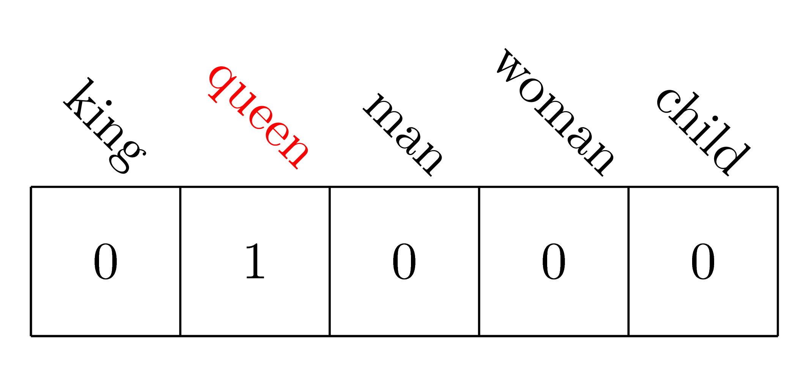

# word vectors


# What is a word vector?

A word vector is a vector of weights. In a simple 1-of-N (or 'one hot') encoding, every element in the vector is associated with a word in the vocabulary. The encoding of a word is the vector in which the corresponding element is one and all other elements are zero.

For example, consider a vocabulary of only five words: king, queen, man, woman, child. The word "queen" could be encoded in 1-of-N encoding as the following:



Using such an encoding, there's no meaningful comparison we can make between word vectors other than equality testing. In word2vec, a *distributed* representation of a word is used. Consider a vector of several hundred dimensions (e.g. 1000). Each word is represented by a distribution of weights across those vectors' elements. So, instead of a one-to-one mapping between an element in the vector and a word, the representation of a word is spread across all of the elements in the vector, and each element in the vector contributes to the definition of many words.

If the dimensions in a hypothetical word vector are labelled (there are no such preassigned labels in the algorithm), it could look like this:


Such a vector comes to represent in some abstract way the "meaning" of a word. With a large corpus, it's possible to learn word vectors that are able to capture the relationships between words in a surprisingly expressive way. The vectors can be used also as inputs to a neural network.

- upcoming documentation

# bags of words, skip-grams and word vectors

Word vectors are an efficient implementation of bag-of-words and skip-gram architectures for computing vector representations of words. These representations can be used in natural language processing applications and research.

An n-gram is a contiguous sequence of n items from a sequence of text or speech. The items can be phonemes, syllabels, letters, words or base pairs depending on the application. Skip-grams are a generalisation of n-grams in which the components (typically words) need not be consecutive in the text under consideration, but may have gaps that are skipped. They are one way of overcoming the data sparsity problem found in conventional n-gram analysis.

Formally, an n-gram is a consecutive subsequence of length n of some sequence of tokens w_n. A k-skip-n-gram is a length-n subsequence in which components occur at a distance of at most k from each other. For example, in the text

```
the rain in Spain falls mainly on the plain
```

the set of 1-skip-2-grams includes all of the 2-grams and, in addition, the following sequences:

```
the in,
rain Spain,
in falls,
Spain mainly,
mainly the,
on plain
```

It has been demonstrated that skip-gram language models can be trained such that it is possible to perform 'word arithmetic'. For example, with an appropriate model, the expression `king - man + woman` evaluates to very close to `queen`.

- "Efficient Estimation of Word Representations in Vector Space", Tomas Mikolov, Kai Chen, Greg Corrado, Jeffrey Dean <http://arxiv.org/abs/1301.3781>

The bag-of-words model is a simplifying representation used in natural language processing. In this model, a text is represented as a bag (multiset -- a set in which members can appear more than once) of its words, disregarding grammar and word order but keeping multiplicity. The bag-of-words model is used commonly in methods of document classification, for which the frequency of occurrence of each word is used as a feature for training a classifier.

Word vectors are continuous distributed representations of words. The tool word2vec takes a text corpus as input and produces word vectors as output. It constructs a vocabulary from the training text data and then learns vector representations of words. A word2vec model is formed by training on raw text. It records the context, or usage, of each word encoded as word vectors. The significance of a word vector is defined as its usefulness as an indicator of certain larger meanings or labels.

# translation with word vectors

In the paper ["Exploiting Similarities among Languages for Machine Translation"](http://arxiv.org/abs/1309.4168), Tomas Milokov describes how, after training two monolingual modes, a translation matrix is generated on the most frequently occurring 5000 words. Using this translation matrix, the accuracy of the translations was tested on 1000 words. A description Milokov gave of the general procedure is as follows:

- Create matrix `M` with dimensionality `I` times `O`, where `I` is the size of input vectors and `O` is the size of the output vectors.
- Iterate over the training set several times with decreasing learning rate and update `M`.
    - For each training sample, compute outputs by multiplying the input vector by `M`.
    - Compute the gradient of the error (target vector - output vector).
    - Update the weights in `M` (with reference to how the weights are updated between the hidden layer and the output layer in word2vec code).
